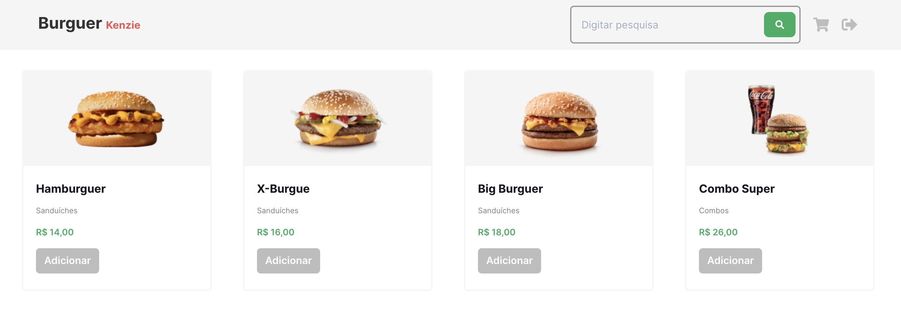
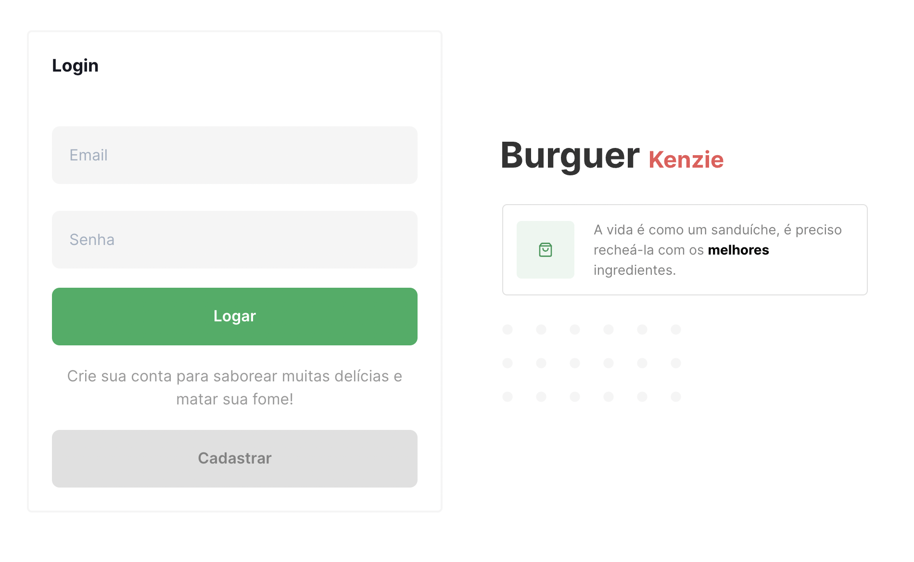

# Hamburgueria

E-comerce web page with Sign up, Login authentication, and dashboard page, based on [Figma project](https://www.figma.com/file/Slx5NlfZ0qcai4lu74tO9u/Hamburgueria-Sprint-5?node-id=0%3A1).

Vercel deploy link: [https://ts-hamburgueria-wagnerfabricio.vercel.app/](https://ts-hamburgueria-wagnerfabricio.vercel.app/)

<td valign="top" width="33%">

## Images:

</td>

<td valign="top" width="33%">

### Techs:

</td>
